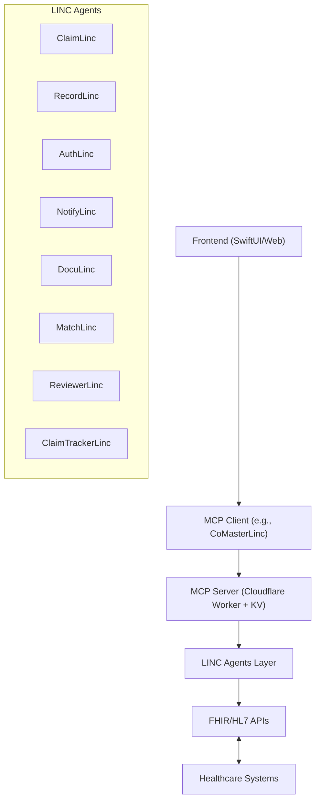

# HealthLinc Ecosystem — Agentic RCM & EHR System Template

**Author**: Dr. Mohamed El Fadil — BRAINSAIT برينسايت Founder & Lead Development and Innovations
**Date**: 2025-05-12
**Purpose**: Template and detailed guide for building a full-stack Agentic Healthcare RCM & EHR system from scratch using FHIR, HL7, Cloudflare MCP, and AI-powered automation.

---

## Table of Contents

1. Overview
2. Core Components
3. System Architecture
4. Technology Stack
5. Getting Started (New!)
6. Backend Setup
7. Frontend Setup
8. Integration with FHIR & HL7
9. MCP Server & Client Setup
10. Agentic Workflow Design
11. Security & Compliance
12. Deployment & Scaling
13. Development Workflow (New!)
14. Continuous Monitoring & Feedback
15. Troubleshooting Guide (New!)
16. Appendices & Resources

---

## 1. Overview

The **HealthLinc Ecosystem** is a modular, secure, and intelligent platform for managing healthcare records and financial workflows. It combines modern interoperability (FHIR, HL7), cloud-native scalability (Cloudflare Workers), and an intelligent agent-based system (LINC agents) for automation and efficiency.

---

## 2. Core Components

- **RCM Module**: Insurance, billing, claims, denials.
- **EHR Module**: Patient charts, observations, clinical notes.
- **FHIR/HL7 Gateway**: Interoperability layer.
- **MCP Server**: Context-aware inference routing.
- **Agentic AI**: Autonomous LINC agents for task handling.
  - **DocuLinc**: Enhanced clinical documentation for medical necessity.
  - **MatchLinc**: Diagnosis-procedure matching validation.
  - **ReviewerLinc**: Fee schedule management and contract alignment.
  - **ClaimTrackerLinc**: Claim tracking with duplicate detection.
- **Clinician Portal**: Interface for doctors/staff.
- **Patient Portal**: Self-service and records access.

---

## 3. System Architecture



---

## 4. Technology Stack

| Layer            | Technology                                |
| ---------------- | ----------------------------------------- |
| Frontend         | SwiftUI (macOS, iPadOS, iOS), HTML/CSS/JS |
| Backend          | FastAPI, Node.js (optional)               |
| AI Agents        | Python (LangChain/OpenAI/Claude SDKs)     |
| Interoperability | FHIR (R4+), HL7 v2.x, HAPI FHIR           |
| Serverless       | Cloudflare Workers, KV storage            |
| Automation       | GitHub Actions, Docker, Coolify           |
| Monitoring       | Grafana, Loki, Promtail                   |
| Security         | JWT, Bearer Tokens, TLS, GDPR/HIPAA       |

---

## 5. Getting Started

### Prerequisites

- Docker and Docker Compose
- Node.js 18+
- Python 3.11+
- Cloudflare Workers account (for MCP)
- OpenAI API key or Anthropic API key

### Installation

1. Clone the repository:

   ```bash
   git clone https://github.com/Fadil369/HealthLinc.git
   cd HealthLinc
   ```

2. Create environment variables:

   ```bash
   # Copy sample env files
   cp .env.example .env
   ```

3. Set up your API keys in `.env`:

   ```plaintext
   OPENAI_API_KEY=your_openai_api_key
   JWT_SECRET=your_secure_jwt_secret
   ```

4. Start the development environment:

   ```bash
   # Start all services
   docker compose up -d
   
   # Or use the helper script
   ./scripts/run.ps1
   ```

5. Access the applications:
   - Patient Portal: [http://localhost:3000](http://localhost:3000)
   - Clinician Portal: [http://localhost:4000](http://localhost:4000)
   - FHIR Gateway: [http://localhost:8000](http://localhost:8000)

---

## 6. Backend Setup

1. Clone MCP Server template (e.g., `brainsait-mcp-secure-worker`)
2. Set up Cloudflare Worker project:

   ```bash
   wrangler init healthlinc-mcp
   wrangler login
   wrangler publish
   ```

3. Add secure KV storage for token access:

   ```bash
   wrangler kv:namespace create "HEALTHLINC_TOKENS"
   ```

4. Add MCP token validation logic:

   ```typescript
   // index.ts
   async function authorize(request) {
     const token = request.headers.get("Authorization");
     // compare against KV
   }
   ```

---

## 7. Frontend Setup (SwiftUI)

1. Create a new project `HealthLincApp`
2. Create `MCPClient.swift`:
   - Handles SSE/REST requests to MCP Server
3. UI Components:
   - `PatientCardView`
   - `ClaimSubmissionView`
   - `ChatAgentView` for AI agents

---

## 8. Integration with FHIR & HL7

- Use `hapi-fhir` or `firely-server` for FHIR backend.
- HL7 listener (MirthConnect) to transform v2.x into FHIR JSON.
- Endpoint examples:

  ```plaintext
  GET /fhir/Patient/123
  POST /fhir/Claim
  ```

---

## 9. MCP Server & Client

- Worker endpoint:

  ```plaintext
  POST /query -> MCP routes to LINC Agent
  ```

- Client (CoMasterLinc) handles UI and decisioning
- Example call:

  ```bash
  curl -X POST https://mcp.healthlinc.workers.dev/query \
    -H "Authorization: Bearer {token}" \
    -d '{"agent":"ClaimLinc","task":"submit","data":{...}}'
  ```

---

## 10. Agentic Workflow Design

Each LINC Agent is:

- Stateless containerized service
- Uses structured `task` + `context` + `goal` format
- Runs AI-powered logic using OpenAI or Claude API
- Logs via DocuLinc

Example agent repo structure:

```plaintext
agent-claimlinc/
├── main.py
├── Dockerfile
├── config.yaml
└── prompts/
    └── submit_claim.txt
```

---

## 11. Security & Compliance

- Bearer Token via KV store
- Enforce HTTPS + IP filtering
- Encrypt all logs (DocuLinc)
- GDPR consent records

---

## 12. Deployment & Scaling

- Use **Coolify** for private deployments
- Deploy agents as Docker containers:

  ```bash
  docker compose up -d
  ```

- Auto-scale MCP with Cloudflare
- Add Cloudflare Tunnel for secure LAN access

---

## 13. Development Workflow

### Branch Strategy

- `main`: Production-ready code
- `develop`: Integration branch for features
- `feature/*`: Feature branches

### Pull Request Process

1. Create feature branch from `develop`
2. Implement changes with tests
3. Submit PR to `develop`
4. Ensure CI passes
5. Require code review
6. Merge to `develop`

### Release Process

1. Create release branch from `develop`
2. Run final tests
3. Version bump in package files
4. Merge to `main`
5. Tag release (e.g., `v1.0.0`)
6. Deploy to production

---

## 14. Continuous Monitoring & Feedback

- Grafana dashboard
- Loki + Promtail for logs
- Telegram notifications via NotifierLinc
- MCP Inspector UI for visual graph of agent responses

---

## 15. Troubleshooting Guide

### Common Issues

#### Docker Connectivity Issues

- Ensure ports are not in use by other services
- Check network isolation settings in docker-compose.yml
- Verify environment variables are properly set

#### Authentication Problems

- Check JWT_SECRET consistency across services
- Verify token expiration settings
- Enable debug logs in AuthLinc

#### FHIR Integration Errors

- Validate FHIR resource formats against schema
- Check FHIR server connectivity
- Review permissions for FHIR operations

#### Agent Communication Failures

- Ensure MCP Server is accessible
- Verify agent configurations
- Check network connectivity between containers

---

## 16. Appendices & Resources

- [FHIR Spec](https://www.hl7.org/fhir/)
- [Cloudflare Worker Docs](https://developers.cloudflare.com/workers/)
- [Coolify Docs](https://docs.coolify.io/)
- [LangChain Templates](https://github.com/langchain-ai/langchain)

---
